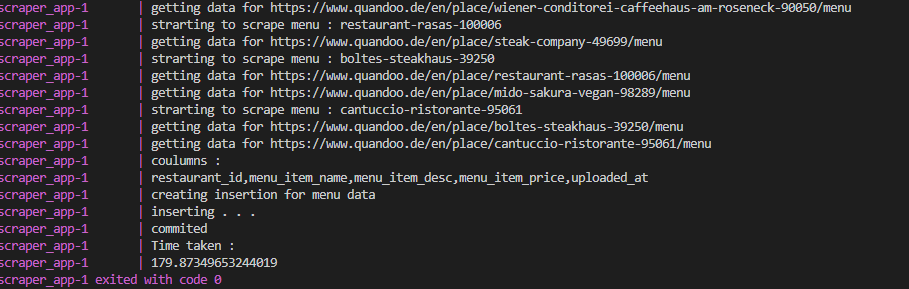

# Quandoo Challenge - Conor O'Reilly

Hello and welcome to my submission for the Quandoo Technical Challenge.

Here I'll outline the project set up, design, running it, an example and my thoughts throughout.

## Section 1 - Design

So the design of my app is quite simple and pretty inline with the diagram.
I have a set of containers managed by docker compose

* a postgres database to store the data
* a pgadmin client just to view the data (not really relevant to the apps actual functionality, just handy to have)
* a python scraper that runs once the DB is up, pulls data and inserts it into the database
* a DBT project that will run after the scraper is done to clean the data and perform some simple calculations

one of the main oddities of this project is that there wasn't any cloud involvement which added a few issues for me 

* One was scheduling, usually these types of things are scheduled on cloud and there's a bunch of tools that help that such as cloud scheduler or airflow or even simple cron jobs. I toyed around with making the python script run via crontab but it was honestly taking too much time, airflow was another option but sadly i was a bit tight on my own schedule so i decided to see if i had time at the end which i didn't really unfortunately.

* Another was security, you won't see me implementing security measures for the simplicity of it, it's not particularly important here and wasn't really mentioned in your task sheet. usually the cloud helps with this, with things such as GCPs secret manager and other functions to allow all the cloud elements to communicate securely.

* the final things was making it take an argument for locations as mentioned in the sheet , usually for these automated processes there's little human input at runtime so i just added a location variable in the .env file, the Geo id idea sounds cool but a bit complex so i left it to the end to get everything working and i ran out of time unfortunately.

The optional sections B and C i've actually omitted here for two different reasons

* part B the visualization i honestly didn't really get time to do, once everything is set up in the DB its not much hassle to connect to it with Tableau or something and do some visualizations with the models created by DBT.

* part C the data lake didn't really seem super needed during my development process i initially just connected the data to the database so the necessity of a data lake in the middle just added more complication than was needed, i have a staging area in postgres which serves just as well to hold the dirtier data

As for the data being pulled, the trip advisor data was a good idea for restaurant data but did not provide much else like menu data from when i looked, also the website is a bit busy which made scraping a pain. I opted to go for Quandoos website, it was quite nice to use to get back into scraping which i admittedly haven't done in a while and was fun. I also thought about APIs but nothing that wasn't paid jumped out at me.

So, what does it actually do once ran? let's set it up first

## Section 2 - Set up and run

assuming you pulled the repo and have it locally, open docker desktop, if you've got it, its a nice ui to show what's going on

in a command line interface go to the directory in the folder with the docker-compose.yml file and run the command 

`docker-compose up --build`

inside the docker ui you should see the containers being set up and run

and that's it really, it's now running, it will set up a db and pgadmin client, scrape data and insert it and process it with dbt models in order

i would add that the scraper takes a while as its pulling quite a bit of data 
(something  like 600 restaurants by default and their menus), so it should take like 
3 minutes

to set the location you must navigate to the .env file and set it there, there are some suggestions left in the comments already

i'll go into more depth below for each section of the process

## Section 3 - Execution 

i'll just run through its execution here, with some explanations, the code itself is pretty well commented but it doesn't hurt to add it here as well

### docker compose

docker compose is for running multi container applications like this one here.
it defines the DB, the python scraper, DBT, a pgadmin client as well as the docker network they will communicate with. it's also defines the order in which they run so DBT wont start before the scraper or the scraper before the DB.

### scraper_app

The scraper app is in the scraper_app directory and defined in its dockerfile. It pulls from a list of requirements (requirement.txt), builds and runs. 
Its pretty straightforward and decently commented but as an overview:
it calls its function to get the restaurants from a location set in the environment file .env .

This scrapes the website for the restaurants and for each restaurant it will get its menu.
this originally took some time so added some threads to speed things up.

When all this data is collected its inserted into the DB in the staging schema.

Something that was mentioned in the task sheet was only adding new data, i opted to insert everything with a timestamp and version the rows,
this way we could see potential changes in prices, ratings, whatever, over time.
inserting only new data would require a connection to the database and a comparison between the data we had and what was potentially coming in.

### DB

The database is a postgres container set up by the docker-compose file so you'll see its settings in there. Again security isn't a priority here so i just added it in hardcoded to get a simple DB up and running locally. There's also a volume added in the compose file that will run on start up, this will create our tables for the dirty input data to go into.

also available is a pgadmin client available at http://localhost:5050/
I just added this to develop the dbt models and to actually see the data clearly.

To log in the email is admin@admin.com and the password is root.
once in you'll need to define the connection, you'll need the IP of the Database, you can get this by opening another powershell window and type 

`docker container ls `

to get the list of containers, copy the container id of the postgres db and type 

`docker inspect` container id

adding the coptied container id as the container id
the ip should be at the bottom under "IPAddress":

the user is myuser and the password is mypassword, both found in the Dbs docker compose definition.

anyways, none of this is necessary, just thought i'd add it if you were interested, on to DBT.

### DBT

DBT is defined in the dbt folder; it holds a couple of yaml files for config as well as the models themselves in dbt/dbt_project/models/marts.

these models will run in order of dependency and after the scraper_app has run, to create tables in the data_mart schema in the database

they contain models to clean the input data, combine it, and perform some calculations that would look nice in some visualization tool :')

### final notes
And finally after all that we should see the data inside the DB 

overall pretty fun challenge, i wasn't expecting something of this scale and trying to get it done in three or four afternoons was definitely the meat of the challenge. If I had some extra time I think implementing the scheduler would be my top priority. also trying to get better configuration for restaurant location would be nice too, such as using geo_loc. 

If after that there was still time i'd look into the scraper app again, tidy up the structure, improve the threading as well as look into only adding new data.

In terms of scaling, getting it into the cloud would be best, adding another service that could split the work and give to individual scrapers, my one is already starting to feel the heat a bit. This all sounds like something Kubernetes could help with, so maybe set up a cluster of scrapers connecting to one centralised DB or data lake and a single DBT container to process it all when done

